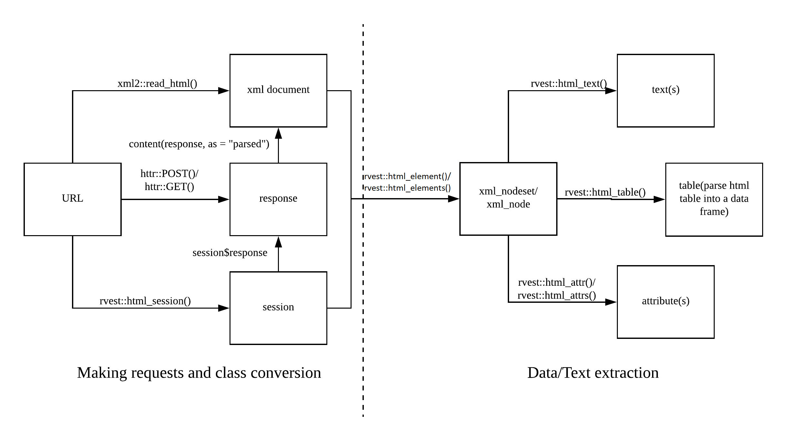

# Web Scraping Reference: Cheat Sheet for Web Scraping using R

Inspired by Hartley Brody, this cheat sheet is about web scraping using [rvest](https://github.com/hadley/rvest),[httr](https://github.com/r-lib/httr), [Rselenium](https://github.com/ropensci/RSelenium) and [Rcrawler](https://github.com/salimk/Rcrawler). It covers many topics in this [blog](https://blog.hartleybrody.com/web-scraping-cheat-sheet/).

While Hartley uses python's requests and beautifulsoup libraries, this cheat sheet covers the usage of httr and rvest. While rvest is good enough for many scraping tasks, httr is required for more advanced techniques. Usage of Rselenium(web driver) is also covered.

I also recommend the book [The Ultimate Guide to Web Scraping](https://blog.hartleybrody.com/guide-to-web-scraping/) by Hartley Brody. Though it uses Python libraries, the underlying logic of web scraping is the same. The same strategies can be applied using any languages including R.

Please post issues [here](https://github.com/yusuzech/r-web-scraping-cheat-sheet/issues) if you find any errors or have any recommendations.

# Table of Contents
1. <a href="#rvest">Web Scraping using rvest and httr</a>
    1. <a href="#rvest1">Useful Libraries and Resources</a>
    2. <a href="#rvest2">Making Simple Requests</a>
    3. <a href="#rvest3">Inspecting Response</a>
    4. <a href="#rvest4">Extracting Elements from HTML</a>
    5. <a href="#rvest5">Storing Data in R</a>
        1. <a href="#rvest5.1">Storing Data as list</a>
        2. <a href="#rvest5.2">Storing Data as data.frame</a>
    6. <a href="#rvest6">Saving Data to disk</a>
        1. <a href="#rvest6.1">Saving Data to csv</a>
        2. <a href="#rvest6.2">Saving Data to SQLite Database</a>
    7. <a href="#rvest7">More Advanced Topics</a>
        1. <a href="#rvest7.1">Javascript Heavy Websites</a>
        2. <a href="#rvest7.2">Content Inside iFrames</a>
        3. <a href="#rvest7.3">Sessions and Cookies</a>
        4. <a href="#rvest7.4">Delays and Backing Off</a>
        5. <a href="#rvest7.5">Spoofing the User Agent</a>
        6. <a href="#rvest7.6">Using Proxy Servers</a>
        7. <a href="#rvest7.7">Setting Timeouts</a>
        8. <a href="#rvest7.8">Handling Network Errors</a>
        9. <a href="#rvest7.9">Downloading Files</a>
        10. <a href="#rvest7.10">Logins and Sessions</a>
        11. <a href="#rvest7.11">Web Scraping in Parallel</a>
2. <a href="#rselenium">Web Scraping using Rselenium</a>
    1. <a href="#rselenium1">Why RSelenium</a>
       1. <a href="#rselenium1.1">Pros and Cons from Using RSelenium</a>
       2. <a href="#rselenium1.2">Useful Resources</a>
    2. <a href="#rselenium2">Interacting with the Web Driver In Rselenium</a>
       1. <a href="#rselenium2.0">How to Start</a>
       2. <a href="#rselenium2.1">Navigating to different URLs</a>
       3. <a href="#rselenium2.2">Simulating Scrolls, Clicks, Text Inputs, Logins, and Other Actions</a>
    3. <a href="#rselenium3">Extract Content from the Web Page</a>
       1. <a href="#rselenium3.1">Extracting Content using Rselenium</a>
       2. <a href="#rselenium3.2">Extracting Content using Parsed Page Source and `rvest`</a>
    4. <a href = "#rselneium4">miscellanea</a>
       1. <a href="#rselenium4.1">Javascript</a>
       2. <a href="#rselenium4.2">Iframe</a>
3. <a href="#rcrawler">Web Scraping using Rcrawler</a>

# 1. <a name="rvest">Web Scraping using rvest and httr</a>
## 1.1. <a name="rvest1">Useful Libraries and Resources</a>

[rvest](https://github.com/hadley/rvest) is built upon the xml2 package and also accept config from the httr package. For the most part, we only need rvest. If we want to add extra configurations, we also need httr.

To install those two packages:

```r
install.packages("rvest")
install.packages("httr")
```

To load them:

```r
require(rvest)
require(httr)
```

There are many resources available online; these are what I found to be the most useful:

1. [Tutorial by Justin Law and Jordan Rosenblum](https://stat4701.github.io/edav/2015/04/02/rvest_tutorial/): web-scraping tutorial using rvest
2. [Tutorial by  SAURAV KAUSHIK](https://www.analyticsvidhya.com/blog/2017/03/beginners-guide-on-web-scraping-in-r-using-rvest-with-hands-on-knowledge/)  : web-scraping tutorial using rvest
3. [Tutorial by Hadley Wickham](http://blog.rstudio.com/2014/11/24/rvest-easy-web-scraping-with-r/)  : web-scraping tutorial using rvest 
4. [w3schools CSS selectors reference](https://www.w3schools.com/CSSref/css_selectors.asp) : if you forget CSS syntax, just check it here
5. [w3schools XPATH reference](<https://www.w3schools.com/xml/xpath_intro.asp>): XPATH is an alternative in selecting elements on websites. It's harder to learn but it's more flexible and robust.
6. [CSS Diner](https://flukeout.github.io/) : the easiest way to learn and understand CSS by playing games.
7. [Chrome CSS selector plugin](https://selectorgadget.com/): a convenient tool to use for choosing CSS selector.
8. [ChroPath](<https://chrome.google.com/webstore/detail/chropath/ljngjbnaijcbncmcnjfhigebomdlkcjo>): a very convenient tool for choosing XPATH.
9. [Stack Overflow](https://stackoverflow.com/) : You can find answers to most of your problems, no matter it's web scraping, rvest or CSS.
10. [Web Scraping Sandbox](http://toscrape.com/): Great place to test your web scraping skills.

**Functions and classes in rvest/httr:**

Sometimes you may get confused about all the functions and classes you have. You can review this image at the moment.


\*\* Please notice that: somtimes response could be JSON or other formats instead of HTML. In those cases you need other functions to parse the content(e.g. jsonlite::fromJSON() to parse a JSON string to a list).


## 1.2. <a name="rvest2">Making Simple Requests</a>

rvest provides two ways of making request: `read_html()` and `html_session()`  
`read_html()` can parse a HTML file or an url into xml document. `html_session()` is built on `GET()` from httr package and can accept configurations any additonal httr config.  

Reading a url:

```R
#making GET request andparse website into xml document
pagesource <- html_read("http://example.com/page")

#using html_session which creates a session and accept httr methods
my_session <- html_session("http://example.com/page")
#html_session is built upon httr, you can also get response with a session
response <- my_session$response
```

Alternatively, GET and POST method are available in the httr package.

```R
library(httr)
response <- GET("http://example.com/page")
#or
response <- POST("http://example.com/page",
    body = list(a=1,b=2))
```

## 1.3. <a name="rvest3">Inspecting Response</a>

Check status code:

```R
status_code(my_session)
status_code(response)
```

Get response and content:

```R
#response
response <- my_session$response
#retrieve content as raw
content_raw <- content(my_session$response,as = "raw")
#retrieve content as text
content_text <- content(my_session$response,as = "text")
#retrieve content as parsed(parsed automatically)
content_parsed <- content(my_session$response,as = "parsed")
```

\*\*note:

Content may be parsed incorrectly sometimes. For those situations, you can parse the content to text or raw and use other libraries or functions to parse it correctly.

Search for specific string:

```R
library(stringr)
#regular expression can also be used here
if(str_detect(content_text,"blocked")){
    print("blocked from website")
    }
```

check content type:

```R
response$headers$`content-type`
```

check html structure:

```R
my_structure <- html_structure(content_parsed)
```

## 1.4. <a name="rvest4">Extracting Elements from HTML</a>

Using the regular expression to scrape HTML is not a very good idea, but it does have its usage like scraping all emails from websites, there is a detailed discussion about this topic on [stackoverflow](https://stackoverflow.com/questions/1732348/regex-match-open-tags-except-xhtml-self-contained-tags).  

**Using rvest:**

I will scrape https://scrapethissite.com/ for demonstration, since it has static HTML:  

For the purpose of extracting elements, using `read_html()` or `html_session()` are both fine. When using `read_html()`, it returns a xml_document. When using `html_session()`, it creates a session and the response is included.

```R
my_session <- html_session("https://scrapethissite.com/pages/simple/")
```

Look for nodes:

```R
my_nodes <- my_session %>% html_nodes(".country")
```

Look for attributes:

```R
my_attributes <- my_session %>% html_nodes(".country-capital") %>% html_attr("class")
```

Look for texts:

```R
my_texts <- my_session %>% html_nodes(".country-capital") %>% html_text()
```

## 1.5. <a name="rvest5">Storing Data in R</a>

rvest can return a vector of elements or even table of elements, so it's easy to store it in R.

### 1.5.1. <a name="rvest5.1">Storing Data as list</a>

Usually, rvest can return a vector, so it's very easy to store it.

```R
my_texts <- my_session %>% html_nodes(".country-capital") %>% html_text()
```

### 1.5.2. <a name="rvest5.2">Storing Data as data.frame</a>

We can concatenate vectors in a table or using `html_table()` to extract a HTML table directly into a data.frame.

```R
my_country <- my_session %>% html_nodes(".country-name") %>% html_text()
my_capitals <- my_session %>% html_nodes(".country-capital") %>% html_text()
my_table <- data.frame(country = my_country, capital = my_capitals)
```

## 1.6. <a name="rvest6">Saving Data to disk</a>
### 1.6.1. <a name="rvest6.1">Saving Data to csv</a>

If the data is already stored as a data.frame:

```R
write.csv(my_table,file="my_table.csv")
```

### 1.6.2. <a name="rvest6.2">Saving Data to SQLite Database</a>

After creating the database "webscrape.db":

```R
library(RSQLite)
connection <- dbConnect(SQLite(),"webscrape.db")
dbWriteTable(conn = connection,name = "country_capital",value = my_table)
dbDisconnect(conn = connection)
```

## 1.7. <a name="rvest7">More Advanced Topics</a>

<!-- 
rvest and httr package provides some handy functions, but they lack the function of:

+ prevent errors from breaking loops
+ auto retry requests
+ keep the record of failed requests

So I wrote a wrapper function on html_session which can deal with the issues above and make web scraping scripts much more robust. The function and usage can be found in this [repository](https://github.com/yusuzech/r-web-scraping-template). 
-->

### 1.7.1. <a name="rvest7.1">Javascript Heavy Websites</a>

For javascript heavy websites, there are three possible solutions:

1. Execute javascript in R
2. Use Developer tools(e.g. [Network in Chrome](https://developers.google.com/web/tools/chrome-devtools/network-performance/))
3. Using Rselenium or other web drivers

There are pros and cons of each method:  
1. Executing Javascript in R is the most difficult one since it requires some knowledge of Javascript, but it makes web-scraping javascript heavy websites possible with rvest.  
2. Using Developer tools is not difficult. The pro is that you only need to learn some examples and you can then work on it by yourself. The con is that if the website structure gets more completed, it requires more knowledge of HTTP.
3. The Rselenium is absolutely the easiest solution. The pro is it's easy to learn and use. The con is that it can be unstable sometimes and related resources are very limited online. In many situations, you may need to refer to python codes with selenium package.

#### 1.Execute javascript

I'm not very familiar with Javascript, and I learned how to use it with this [post](https://datascienceplus.com/scraping-javascript-rendered-web-content-using-r/) 

#### 2.Use Developer tools

I learned this trick from Hartley's blog; the following section is quoted from his [post](https://blog.hartleybrody.com/web-scraping-cheat-sheet/):

>Contrary to popular belief, you do not need any special tools to scrape websites that load their content via Javascript. For the information to get from their server and show up on a page in your browser, that information had to have been returned in an HTTP response somewhere.
>
>It usually means that you won’t be making an HTTP request to the page’s URL that you see at the top of your browser window, but instead you’ll need to find the URL of the AJAX request that’s going on in the background to fetch the data from the server and load it into the page.
>
>There’s not really an easy code snippet I can show here, but if you open the Chrome or Firefox Developer Tools, you can load the page, go to the “Network” tab and then look through the all of the requests that are being sent in the background to find the one that’s returning the data you’re looking for. Start by filtering the requests to only XHR or JS to make this easier.
>
>Once you find the AJAX request that returns the data you’re hoping to scrape, then you can make your scraper send requests to this URL, instead of to the parent page’s URL. If you’re lucky, the response will be encoded with JSON which is even easier to parse than HTML.

So, as Hartley said, basically, everything displayed on your browser must be sent to you through JSON, HTML or other formats. What you need to do is to capture this file. 

I answered a couple of questions on Stack Overflow about scraping JavaScript rendered content. You may have the same problems as in the posts. Please check out the answers, and hope you get the ideas of how to use developer tools.

https://stackoverflow.com/questions/50596714/how-to-scrap-a-jsp-page-in-r/50598032#50598032  
https://stackoverflow.com/questions/50765111/hover-pop-up-text-cannot-be-selected-for-rvest-in-r/50769875#50769875  
https://stackoverflow.com/questions/50900987/scraping-dl-dt-dd-html-data/50922733#50922733  
https://stackoverflow.com/questions/50693362/unable-to-extract-thorough-data-using-rvest/50730204#50730204  
https://stackoverflow.com/questions/50997094/trouble-reaching-a-css-node/50997121#50997121  
https://stackoverflow.com/questions/50262108/scraping-javascript-rendered-content-using-r/50263349#50263349  

#### 3.Using Rselenium or other web driver

Rselenium launches a Chrome/Firefox/IE browser where you can simulate human actions like clicking on links, scrolling up or down.  

It is a very convenient tool, and it renders JavaScript and Interactive content automatically, so you don't need to worry about the complex HTTP and AJAX stuff. However, there are also some limitations to it:  

1. The first limitation is that:  it is very slow. Depending on the complexity of the websites, it could take seconds to render a single page while using httr/rvest takes less than one second. It is fine if you only want to scrape several hundred pages. However, if you want scrape thousands or ten thousands of pages, then the speed will become an issue.
2. The second limitation is that: There are little online resources on Rselenium. In many situations, you can't find related posts on Stack Overflow that solve your problem. You may need to refer to Python/Java Selenium posts for answers, and sometimes answers can't be applied in R.

More detailed usage is explained in **Web Scraping using Rselenium**.

### 1.7.2. <a name="rvest7.2">Content Inside iFrames</a>

Iframes are other websites embedded in the websites you are viewing as explained on [Wikipedia](https://en.wikipedia.org/wiki/HTML_element#Frames):

> Frames allow a visual HTML Browser window to be split into segments, each of which can show a different document. This can lower bandwidth use, as repeating parts of a layout can be used in one frame, while variable content is displayed in another. This may come at a certain usability cost, especially in non-visual user agents,[[51\]](https://en.wikipedia.org/wiki/HTML_element#cite_note-58) due to separate and independent documents (or websites) being displayed adjacent to each other and being allowed to interact with the same parent window. Because of this cost, frames (excluding the `<iframe>` element) are only allowed in HTML 4.01 Frame-set. Iframes can also hold documents on different servers. In this case, the interaction between windows is blocked by the browser. 


Therefore, to extract content in an iframe, you need to find the link to that HTML.

```R
#example script
link_to_iframe <- my_session("www.example.com") %>%
    html_node("css to locate the iframe") %>%
    html_attr("src")
#make another request to the iframe and use this session to extract information
iframe_session <- html_session(link_to_iframe)
```


Here is a tutorial about iframes using [scrapethissite](https://blog.hartleybrody.com/web-scraping-cheat-sheet/#content-inside-iframes):

In this tutorial, we will get information embedded in an iframe: [**Tutorial Link**](example_script/iframe_tutorial.md)  


### 1.7.3. <a name="rvest7.3">Sessions and Cookies</a>

`rvest::html_session()` creates a session automatically, you can use `jump_to()` and `follow_link` to navigate to other web pages using the same session.


```R
library(rvest)
url1 <- "https://scrapethissite.com/"
url2 <- "https://scrapethissite.com/pages/simple/"
my_session <- html_session(url1)
my_session <- my_session %>% jump_to(url2) # navigate to another url
```


you can check session history:


```R
> session_history(my_session)
  https://scrapethissite.com/
- https://scrapethissite.com/pages/simple/
```


 you can access the cookies:

```R
library(httr)
cookies(my_session) #cookies are saved in a table
```


### 1.7.4. <a name="rvest7.4">Delays and Backing Off</a>

You can slow down your requests by pausing between requests:


```R
library(httr)
for(my_url in my_urls){
    response <- httr::GET(my_url)
    #do something
    Sys.sleep(5) # sleep 5 seconds
}
```


You can also decide how you wait by measuring how long the site took to respond. So why should you do it, as Hartley says:

> Some also recommend adding a backoff that’s proportional to how long the site took to respond to your request. That way if the site gets overwhelmed and starts to slow down, your code will automatically back off. 


```R
library(httr)
for(my_url in my_urls){
    t0 <- Sys.time()
    response <- httr::GET(my_url)
    t1 <- Sys.time()
    #do something
    response_delay <- as.numeric(t1-t0)
    Sys.sleep(10*response_delay) # sleep 10 times longer than response_delay
}

```


### 1.7.5. <a name="rvest7.5">Spoofing the User Agent</a>

**First of all, what is a user agent?**

> In computing, a user agent is software (a software agent) that is acting on behalf of a user. One common use of the term refers to a web browser telling a website information about the browser and operating system. This allows the website to customize content for the capabilities of a particular device, but also raises privacy issues.

In short, a user agent is a string that identifies you, and you can search "most popular browser user agents" on google to get a rough idea.

**So why should I use spoof user agent?**  

* You want to make your scraper look like a real user instead of a script. Some websites even don't allow an uncommon user agent to access.

```R
library(rvest)
my_session <- html_session("https://scrapethissite.com/")
# if you don't use custom user agent, your user agent will be something like:
# RUN: my_session$response$request$options$useragent
"libcurl/7.59.0 r-curl/3.2 httr/1.3.1"
```

**So how can I spoof it?**

```R
library(rvest)
library(httr)
#1.spoof it with common user agent
ua <- user_agent("Mozilla/5.0 (Windows NT 10.0; Win64; x64) AppleWebKit/537.36 (KHTML, like Gecko) Chrome/58.0.3029.110 Safari/537.36")
seesion_with_ua <- html_session("https://scrapethissite.com/",ua)
#2.fill your contact information in user agent if you want the website owner to contact you
ua_string <- "Contact me at xyz123@gmail.com"
seesion_with_ua <- html_session("https://scrapethissite.com/",user_agent(ua_string))
```

### 1.7.6. <a name="rvest7.6">Using Proxy Servers</a>

Some servers automatically ban an IP if it sees abnormal traffic from that IP. The way to avoid it is to use proxies, so you can spread your requests among different IPs and reduce the chance of the server banning you. 

Though there are many free proxies available, paid ones are usually more reliable. One provider I use is "Proxy Bonanza."

Once you have free or paid proxies, you can use them when you make requests:

```R
library(rvest)
library(httr)
my_proxy <- use_proxy(url="http://example.com",
                     user_name = "myusername",
                     password = "mypassword",
                     auth = "one of basic, digest, digest_ie, gssnegotiate, ntlm, any")
#use it in html_session(),POST() or GET()
my_session <- html_session("https://scrapethissite.com/",my_proxy)
my_response <- GET("https://scrapethissite.com/",my_proxy)
```

### 1.7.7. <a name="rvest7.7">Setting Timeouts</a>

Sometimes you may encounter slow connections and want to move to other jobs instead of waiting. You can set timeout if you don't receive a response.    

```R
library(rvest)
library(httr)
my_session <- html_session("https://scrapethissite.com/",timeout(5)) # if you don't receive reponse within 5 seconds, it will throw an error

#you can use try() or tryCatch() to continue if the error occured
for(my_url in my_urls){
    try(GET(my_url,timeout(5)))
}
```

For detailed usage of `try()` and `tryCatch()`, you can check the following posts:

https://stackoverflow.com/questions/12193779/how-to-write-trycatch-in-r

### 1.7.8. <a name="rvest7.8">Handling Network Errors</a>

You can use `try()` or `tryCatch()` to handle unpredictable network issues.

You can retry if an error occurs. For more details, you can check the following posts:

https://stackoverflow.com/questions/20770497/how-to-retry-a-statement-on-error

### 1.7.9. <a name="rvest7.9">Downloading Files</a>  

Most of the times, the purpose of web scrapping is to extract texts from web pages. But there are also scenarios that you want to save images,web pages or other files.

**Downloading files using `download.file()`**

`download.file()` is a built-in function in R and it's very easy to use. But it doesn't support extra configurations such as proxies or user agents.

```R
#Download a web page
my_url <- "https://scrapethissite.com/"
download.file(url = my_url, # required: provide url 
              destfile = "test.html", # required: path and name for downloaded file
              quiet = T, # optional: whether to suppress messages
              mode = "w") #optional: default to "w", switch to other modes if file is garbled

#Download a image
image_url <- "https://upload.wikimedia.org/wikipedia/commons/thumb/7/71/GreenSeaTurtle-2.jpg/200px-GreenSeaTurtle-2.jpg"
download.file(image_url,"turtle1.jpg",mode = "wb") #mode must be wb(binary) for images
```


**Downloading files using `writeBin()`**

Another option is to use `writeBin()` function to download files. This function can write the content from  the response to a binary file.

```R
library(httr)
#use writeBin() to write a html file
my_url <- "https://scrapethissite.com/"
response <- GET(my_url)
writeBin(response$content,"test1.html")

#downlaod images using `writeBin()`
image_url <- "https://upload.wikimedia.org/wikipedia/commons/thumb/7/71/GreenSeaTurtle-2.jpg/200px-GreenSeaTurtle-2.jpg"
response <- GET(image_url)
writeBin(response$content,"turtle2.jpg")
```

### 1.7.10. <a name="rvest7.10">Logins and Sessions</a>

Sometimes you need to log in to access certain content. You can do it using rvest and httr. You can also save your cookies so you don't need to log in every time.

**Log in using rvest:**

```R
library(rvest)
url <- "https://example.com/login"
my_session <- html_session(url) #Create a persistant session
unfilled_forms <- html_form(my_session) # find all forms in the web page
login_form <- unfilled_forms[[1]] # select the form you need to fill
filled_form <- set_values(login_form,username="myusername",password="mypassword") # fill the form
login_session <- submit_form(my_session,filled_form) # Now you're logged in
```

There is also a built-in [demo](https://github.com/hadley/rvest/blob/master/demo/united.R) for logins in rvest.

**Using the session**

`html_session()` simulates a session in an html browser, you can navigate to other pages using the same session with same cookies.

To stay in the same session, you can use `jump_to()` and `follow_link()`:

```R
library(rvest)
url <- "www.example.com"
my_session <- html_session(url) # create a session
my_session1 <- my_session %>% jump_to("www.example.com/page1") # go to another web page using the same session
my_session2 <- my_session %>% follow_link(css = "p a")
```


You can also stay in the same session by using cookies: 

```R
library(rvest)
library(httr)
url <- "http://ww.example.com"
my_session <- html_session(url) # create a session
my_cookies_table <- cookies(my_session) # get the cookies as a table
my_cookies <- my_cookies_table$value %>% setNames(my_cookies_table$name) # save the cookies as a named vector that you can use in your requests
new_session <- html_session(url,set_cookies(my_cookies)) # making requests using the same cookies/session
```

### 1.7.11. <a name="rvest7.11">Web Scraping in Parallel</a>

To speed up web scraping process, you may want to do it in parallel. To achieve this goal, you can use [`doParallel`](https://cran.r-project.org/web/packages/doParallel/index.html) package or [`Rcrawler`](https://github.com/salimk/Rcrawler) package. The later package has parallel web scraping as a built in feature, it also has many other great features and the developers are adding even more.   For this part, we are focusing on `doParallel`.

```R
library(rvest)
library(doParallel)
#assume we have a list of urls
#urls <- c("url1","url2,...")
cl <- makeCluster(detectCores()-1) #using max cores - 1 for parallel processing
registerDoParallel(cl) #register cores

# use foreach() %dopar%{} to make requests and parese texts in parallel
result <- foreach(i = seq_along(urls),
                  .packages = "rvest",
                  .combine = "c",
                  .errorhandling='pass') %dopar% {
                      text <- html_session(urls[i]) %>% 
                          html_nodes("css") %>%
    					  html_text()
                      return(text)
                  }
```

In this [example](resources/rvest_parallel.md), it compares the speed between  `foreach` and `for` loop.

Also, you need to be aware of that: as you are making more concurrent requests, you are much more likely to get banned. So remember to use proxies or reduce the speed of requests. 

****

# 2. <a name="rselenium">Web Scraping using Rselenium</a>

## 2.1. <a name="rselenium1">Why RSelenium</a>

As mentioned in previous sections, in JavaScript heavy websites, the majority of content could be generated using JavaScript. When using a browser, it will make multiple requests for you while the original page is loading. However, if you use `httr` or `rvest`, only the original page will be loaded and JavaScript won't be executed. Hence some data is only available in browser.


[RSelenium](https://github.com/ropensci/RSelenium) makes use of [Selenium Web Driver](https://www.seleniumhq.org/projects/webdriver/) which simulates a browser(usually Chrome and Firefox) and renders web pages automatically, it will execute all the JavaScript codes for you so you will get a parsed page source instead of unparsed(raw) one.

### 2.1.1 <a name="rselenium1.1">Pros and Cons from Using RSelenium</a>

**Pros:**

1. Renders JavaScript generated content automatically:
   * One of the greatest headache from web scraping is that what you see in browser and what you get in response are different. By using RSelenium, you can avoid this issue.

**Cons:**

1. It's very slow:
   * Since the browser loads everything on the web page(including photos, ads or even videos), it will be really slow comparing to making requests using `httr` or `rvest`.
2. Lacking support:
   * Comparing to Selenium in Python, RSelenium doesn't have a large user base and hence lacks support. If you ever searched RSelenium related questions, you might already found out that: many solutions could be obsolete , you couldn't find related topics or the only solutions available were for Python..

### 2.1.2 <a name="rselenium1.2">Useful Resources</a>

1. [Rselenium Github Page](https://github.com/ropensci/RSelenium): many useful resources are already listed here.
2. [http://toscrape.com/](http://toscrape.com/): A sandbox for testing your web scraping script.

## 2.2 <a name="rselenium2">Interacting with the Web Driver In Rselenium</a>

### 2.2.1. <a name="rselenium2.0">How to Start</a>

```R
# Load the Library
library(RSelenium)

# start the server and browser(you can use other browsers here)
rD <- rsDriver(browser=c("firefox"))

driver <- rD$client

# navigate to an URL
driver$navigate("http://books.toscrape.com/")

#close the driver
driver$close()

#close the server
rD$server$stop()
```

**Common Issues and Solutions when starting the server and browser** 

1. Port already in use:
   - Solutions: [close the server](<https://stackoverflow.com/questions/43991498/rselenium-server-signals-port-is-already-in-use>)


### 2.2.2. <a name = "rselenium2.1">Navigating to different URLs</a>

**Using `driver.navigate()`:**

```
driver$navigate("http://books.toscrape.com/")
```

**Simulating a click on the link:**

```R
# navigate to an URL
driver$navigate("http://toscrape.com/")

# find the element
elements <- driver$findElements("a",using = "css")

# click the first link 
elements[[1]]$clickElement()
```

**Go Back or Go Forward**

```R
driver$goBack()
driver$goForward()
```

### 2.2.3. <a name = "rselenium2.2">Simulating Scrolls, Clicks, Text Inputs, Logins, and Other Actions</a>

**1. Simulating Scrolls:**

You can scroll up or down by sending the `pageUp` or `pageDown` keypress to the browser. 

*Scroll Down Once:*

```R
driver$navigate("http://quotes.toscrape.com/scroll")
# find the webpage body
element <- driver$findElement("css", "body")

#scroll down once ----
element$sendKeysToElement(list(key = "page_down"))
```

*Scroll Down Multiple Times:*

```R
element <- driver$findElement("css", "body")
# Scroll down 10 times
for(i in 1:10){
    element$sendKeysToElement(list("key"="page_down"))
    # please make sure to sleep a couple of seconds to since it takes time to load contents
    Sys.sleep(2) 
}
```

*Scroll Down Until the End(Not Recommended if There Are too Many Pages):*

```r
element <- driver$findElement("css", "body")
flag <- TRUE
counter <- 0
n <- 5
while(flag){
    counter <- counter + 1
    #compare the pagesource every n(n=5) time, since sometimes one scroll down doesn't render new content
    for(i in 1:n){
        element$sendKeysToElement(list("key"="page_down"))
        Sys.sleep(2)
    }
    if(exists("pagesource")){
        if(pagesource == driver$getPageSource()[[1]]){
            flag <- FALSE
            writeLines(paste0("Scrolled down ",n*counter," times.\n"))
        } else {
            pagesource <- driver$getPageSource()[[1]]
        }
    } else {
        pagesource <- driver$getPageSource()[[1]]
    }
}
```


**2. Simulating Clicks:**

*Click a Single Element by CSS:*

```R
driver$navigate("http://quotes.toscrape.com/scroll")

#locate element using CSS(find the first match)
driver$navigate("https://scrapethissite.com/pages/ajax-javascript/#2011")
element <- driver$findElement(using = "css",".year-link")
element$clickElement()
```

*Click a Single Element by Moving Mouse to Element:*

```R
driver$navigate("https://scrapethissite.com/pages/ajax-javascript/#2011")
element <- driver$findElement(using = "css",".year-link")
driver$mouseMoveToLocation(webElement = element)
driver$click()
```

*Click Multiple Items:*

```R
driver$navigate("https://scrapethissite.com/pages/ajax-javascript/#2011")
elements <- driver$findElements(using = "css",".year-link")
for(element in elements){
    element$clickElement()
    Sys.sleep(2)
}
```

*Go to Different URLs by Clicking Links:*

```R
driver$navigate("http://books.toscrape.com/")
elements <- driver$findElements(using = "css",".nav-list ul a")
for(i in 1:length(elements)){
    elements[[i]]$clickElement()
    Sys.sleep(2)
    #do something and go back to previous page
    driver$goBack()
    Sys.sleep(1)
    # refresh the elements
    elements <- driver$findElements(using = "css",".nav-list ul a")
}
```

**3. Simulating Text Input:**

*Enter Text and Search*

```R
driver$navigate("https://www.google.com/")
#selcet input box
element <- driver$findElement(using = "css",'input[name="q"]')
#send text to input box. don't forget to use `list()` when sending text
element$sendKeysToElement(list("Web Scraping"))
#select search button
element <- driver$findElement(using = "css",'input[name="btnK"]')
element$clickElement()
```


*Clear Input Box*

```R
driver$navigate("https://www.google.com/")
#selcet input box
element <- driver$findElement(using = "css",'input[name="q"]')
element$sendKeysToElement(list("Web Scraping"))
#clear input box
element$clearElement()
```


**4. Logins:**

Login is simple using RSelenium. Instead of doing post request, it's just a combination of sending texts to input boxes and click login button.


```R
driver$navigate("http://quotes.toscrape.com/login")
#enter username
element <- driver$findElement(using = "css","#username")
element$sendKeysToElement(list("myusername"))
#enter password
element <- driver$findElement(using = "css","#password")
element$sendKeysToElement(list("mypassword"))
#click login button
element <- driver$findElement(using = "css", 'input[type="submit"]')
element$clickElement()
```


**5. Simulating Key and Button Presses:**

You can also send keys to the browser, you can check all available keys by running `RSelenium::selKeys`.

*Available Keys:*

```R
 [1] "null"         "cancel"       "help"         "backspace"    "tab"          "clear"        "return"       "enter"        "shift"        "control"     
[11] "alt"          "pause"        "escape"       "space"        "page_up"      "page_down"    "end"          "home"         "left_arrow"   "up_arrow"    
[21] "right_arrow"  "down_arrow"   "insert"       "delete"       "semicolon"    "equals"       "numpad_0"     "numpad_1"     "numpad_2"     "numpad_3"    
[31] "numpad_4"     "numpad_5"     "numpad_6"     "numpad_7"     "numpad_8"     "numpad_9"     "multiply"     "add"          "separator"    "subtract"    
[41] "decimal"      "divide"       "f1"           "f2"           "f3"           "f4"           "f5"           "f6"           "f7"           "f8"          
[51] "f9"           "f10"          "f11"          "f12"          "command_meta"
```


*Send Key Combinations:*

```R
driver$navigate("https://scrapethissite.com/pages/ajax-javascript/#2015")
Sys.sleep(2)
# Press Control+A to select the entire page
driver$findElement(using = "css","body")$sendKeysToElement(list(key="control","a"))

```


## 2.3. <a name="rselenium3">Extracting Texts from Web Pages</a>

### 2.3.1. <a name="rselenium3.1">Extracting Content using Rselenium</a>

You can use `findElement()` or `findElements()` to extract single or multiple elements from page source.

**1.  Extract text from a single element:**

use `findElment()` method to select a single matching element, and use `getElementText()` method to extract text.

```R
driver$navigate("https://scrapethissite.com/pages/simple/")
element <- driver$findElement(using = "css",".country-capital")
# get element text
element$getElementText()[[1]]
#get element attribute value(get the value for class)
element$getElementAttribute("class")[[1]]
```


**2. Extract text from a list of elements:**

`RSelenium` doesn't support vectorized calculation.So you need to use for loops, apply or map(in `purrr` package) as alternative to get lists of items.

use `findElements()` method to select all matching elements, and use `getElementText()` method to extract text.

```R
driver$navigate("https://scrapethissite.com/pages/simple/")
Sys.sleep(2)
elements <- driver$findElements(using = "css",".country-capital")
```


*Use for loop to extract elements:*

```R
texts <- c()
for(ele in elements){
    texts <- append(texts,ele$getElementText()[[1]])
}
```


*Use apply functions to extract elements:*

```R
# use lapply
texts_lapply <- lapply(elements,function(x) x$getElementText()[[1]])
# use sapply
texts_sapply <- sapply(elements,function(x) x$getElementText()[[1]])
```


*Use map functions(using `purrr`) to extract elements:*

```R
library(purrr)
# get result as a list
texts_purrr_map <- map(elements,~ .x$getElementText()[[1]])
# get result as a string vector
texts_purrr_map_chr <- map_chr(elements,~ .x$getElementText()[[1]])
```

 

**3. Extract attribute(s) from a single element(s)**

The usage is the same as extracting text from element(s), the only difference it that you need to use `getElementAttribute()` method.

```R
book_partial_links <- lapply(elements,function(x) x$getElementAttribute(attrName="href"))
```


### 2.3.2. <a name="rselenium3.2">Extracting Content using Parsed Page Source and `rvest`</a>

Since the browser will execute JavaScript codes by default, you can use `RSelenium` as a tool to get the parsed content from webpages. In this way, you can benefit from the vectorized calculation in `rvest`. 

Another benefit of using `rvest` is that it runs much faster while extracting information from page source comparing to using `getElementText()` or `getElementAttribute()` method.

```R
library(rvest)
driver$navigate("https://scrapethissite.com/pages/ajax-javascript/#2015")
Sys.sleep(2)
# get parsed page source
parsed_pagesource <- driver$getPageSource()[[1]]
# using rvest to extract information
result <- read_html(parsed_pagesource) %>%
    html_nodes(".film-title") %>%
    html_text()
```


## 2.4. <a name = "rselneium4">miscellanea</a>

### 2.4.1. <a name="rselenium4.1">Javascript</a>

Congratulations, no more concerns about AJAX or JavaScript as the browser will parse everything for you!

### 2.4.2. <a name="rselenium4.2">Iframe</a>

Let's try to get all turtles family name in this [webpage](https://scrapethissite.com/pages/frames/), it doesn't work because the content is another webpage nested in the current one.

```R
driver$navigate("https://scrapethissite.com/pages/frames/")
# select all turtles' name
elements <- driver$findElements(using = "css",".family-name")
print(elements)
> list()
```


To read the content from inside iframe, we can use `switchToFrame` method.

> switchToFrame(Id)
> Change focus to another frame on the page. Id can be string|number|null|WebElement Object. If the Id is null, the server should switch to the page's default content.

```R
driver$navigate("https://scrapethissite.com/pages/frames/")
# select iframe element
element <- driver$findElement(using = "css","#iframe")
#switch to the iframe
driver$switchToFrame(element)

elements <- driver$findElements(using = "css",".family-name")
for (ele in elements){
    print(ele$getElementText()[[1]])
}
#switch back to the default page
driver$switchToFrame()
```

# 3. <a name="rcrawler">Web Scraping using Rcrawler</a>
