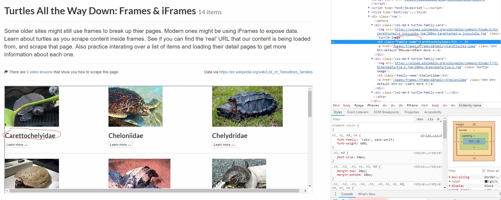
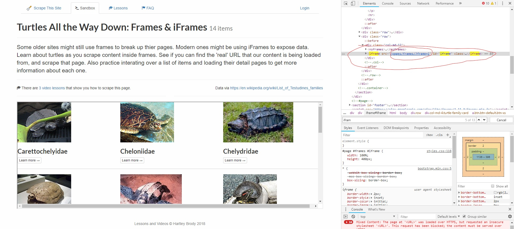

Iframe Tutorial: Extract Information Inside Iframes
================
yusuzech
July 30, 2018

In this tutorial, we are going to use this website: <https://scrapethissite.com/pages/frames/> to extract information inside iframes.

1 Normal method should fail
---------------------------

At first, let's extract each turtle's name as shown in the image below:



Let's try the following codes:

``` r
library(rvest)
my_url <- "https://scrapethissite.com/pages/frames/"
turtle_names <- html_session(my_url) %>%
    html_nodes(".family-name") %>%
    html_text()
print(turtle_names)
```

    ## character(0)

It failed and returned nothing. The reason is that those information are actually from another HTML file and is imbedded in the current page you are reading. So you can't extract anything from current website.

2 Find the iframe
-----------------

To extract turtles' name, we need to find the link to the iframe. Let's use Chrome Developer Tool to find the linke to iframe:
We can use ctrl+F and search for keyword "iframe" and here we find the link.


Let's do this in R and this time it should succeed:

``` r
library(rvest)
library(stringr)
my_url <- "https://scrapethissite.com/pages/frames/"
#extract source as hown in the image above
iframe_src <-  html_session(my_url) %>%
    html_node("#iframe") %>%
    html_attr("src")
#get the url to that iframe
iframe_url <- str_c("https://scrapethissite.com",iframe_src)
#extract turtle names:
turtle_names <- html_session(iframe_url) %>%
    html_nodes(".family-name") %>%
    html_text()
print(turtle_names)
```

    ##  [1] "Carettochelyidae" "Cheloniidae"      "Chelydridae"     
    ##  [4] "Dermatemydidae"   "Dermochelyidae"   "Emydidae"        
    ##  [7] "Geoemydidae"      "Kinosternidae"    "Platysternidae"  
    ## [10] "Testudinidae"     "Trionychidae"     "Chelidae"        
    ## [13] "Pelomedusidae"    "Podocnemididae"
